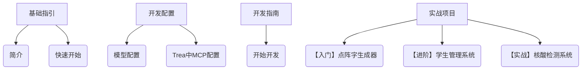

# ○ 天互文档 Tianhu Docs ——Trea 实战项目文档站 🚀

```
 _________  ___  ________  ________   ___  ___  ___  ___          ________  ________  ________  ________      
|\___   ___\\  \|\   __  \|\   ___  \|\  \|\  \|\  \|\  \        |\   ___ \|\   __  \|\   ____\|\   ____\     
\|___ \  \_\ \  \ \  \|\  \ \  \\ \  \ \  \\\  \ \  \\\  \       \ \  \_|\ \ \  \|\  \ \  \___|\ \  \___|_    
     \ \  \ \ \  \ \   __  \ \  \\ \  \ \   __  \ \  \\\  \       \ \  \ \\ \ \  \\\  \ \  \    \ \_____  \   
      \ \  \ \ \  \ \  \ \  \ \  \\ \  \ \  \ \  \ \  \\\  \       \ \  \_\\ \ \  \\\  \ \  \____\|____|\  \  
       \ \__\ \ \__\ \__\ \__\ \__\\ \__\ \__\ \__\ \_______\       \ \_______\ \_______\ \_______\____\_\  \ 
        \|__|  \|__|\|__|\|__|\|__| \|__|\|__|\|__|\|_______|        \|_______|\|_______|\|_______|\_________\
                                                                                                  \|_________|               
```


> 基于 Trea 框架的 **从入门到实战** 全栈开发指南，通过三个递进式项目，掌握 MCP 配置、模型设计与实际业务落地。

## 项目定位
专为开发者打造的 **实战型学习平台**，从基础的点阵字生成器到企业级核酸检测系统，覆盖：
- Trea 框架核心用法（MCP 配置、模型设计）
- 前后端协同开发流程
- 实际业务场景问题解决

## 文档结构


## 适用人群
- 前端/后端开发者（零基础友好）
- 想快速上手 Trea 框架的技术学习者
- 需落地实际项目的开发工程师

## 技术栈
- 核心框架：Trea
- 配置核心：MCP（Module Configuration Protocol）
- 开发语言：JavaScript/TypeScript
- 配套工具：Node.js ≥ 16.x、npm ≥ 8.x
