# ○ 天互文档 Tianhu Docs ——Trea 实战项目文档站 🚀

```
 _________  ___  ________  ________   ___  ___  ___  ___          ________  ________  ________  ________      
|\___   ___\\  \|\   __  \|\   ___  \|\  \|\  \|\  \|\  \        |\   ___ \|\   __  \|\   ____\|\   ____\     
\|___ \  \_\ \  \ \  \|\  \ \  \\ \  \ \  \\\  \ \  \\\  \       \ \  \_|\ \ \  \|\  \ \  \___|\ \  \___|_    
     \ \  \ \ \  \ \   __  \ \  \\ \  \ \   __  \ \  \\\  \       \ \  \ \\ \ \  \\\  \ \  \    \ \_____  \   
      \ \  \ \ \  \ \  \ \  \ \  \\ \  \ \  \ \  \ \  \\\  \       \ \  \_\\ \ \  \\\  \ \  \____\|____|\  \  
       \ \__\ \ \__\ \__\ \__\ \__\\ \__\ \__\ \__\ \_______\       \ \_______\ \_______\ \_______\____\_\  \ 
        \|__|  \|__|\|__|\|__|\|__| \|__|\|__|\|__|\|_______|        \|_______|\|_______|\|_______|\_________\
                                                                                                  \|_________|               
```


> 基于 Trea 框架的 **从入门到实战** 全栈开发指南，通过三个递进式项目，掌握 MCP 配置、模型设计与实际业务落地。

## 项目定位
专为开发者打造的 **实战型学习平台**，从基础的点阵字生成器到企业级核酸检测系统，覆盖：
- Trea 框架核心用法（MCP 配置、模型设计）
- 前后端协同开发流程
- 实际业务场景问题解决

## 文档结构

```mermaid
graph TD
    A[基础指引] --> A1(简介)
    A --> A2(快速开始)
    B[开发配置] --> B1(模型配置)
    B --> B2(Trea中MCP配置)
    C[开发指南] --> C1(开始开发)
    D[实战项目] --> D1(【入门】点阵字生成器)
    D --> D2(【进阶】学生管理系统)
    D --> D3(【实战】核酸检测系统)
```


## 适用人群
- 前端/后端开发者（零基础友好）
- 想快速上手 Trea 框架的技术学习者
- 需落地实际项目的开发工程师

## 技术栈
- 核心框架：Trea
- 配置核心：MCP（Module Configuration Protocol）
- 开发语言：JavaScript/TypeScript
- 配套工具：Node.js ≥ 16.x、npm ≥ 8.x


<!DOCTYPE html>
<html>
<head>
    <meta charset="UTF-8">
    <title>修复版渐变加粗艺术字</title>
    <style>
        body {
            background: #f5f5f5;
            padding: 30px;
            display: flex;
            justify-content: center;
        }
        .art-text {
            font-family: "Courier New", monospace;
            font-size: 16px;
            font-weight: bold;
            line-height: 1.2;
        }
        /* 逐行渐变（蓝→紫） */
        .line1 { color: #4285f4; }
        .line2 { color: #5c6bc0; }
        .line3 { color: #7986cb; }
        .line4 { color: #9575cd; }
        .line5 { color: #b39ddb; }
        .line6 { color: #ce93d8; }
        .line7 { color: #e1bee7; }
    </style>
</head>
<body>
<pre class="art-text">
<span class="line1">_________  ___  ________  ________   ___  ___  ___  ___          ________  ________  ________  ________      </span>
<span class="line2">|\___   ___\\  \|\   __  \|\   ___  \|\  \|\  \|\  \|\  \        |\   ___ \|\   __  \|\   ____\|\   ____\     </span>
<span class="line3">\|___ \  \_\ \  \ \  \|\  \ \  \\ \  \ \  \\\  \ \  \\\  \       \ \  \_|\ \ \  \|\  \ \  \___|\ \  \___|_    </span>
<span class="line4">     \ \  \ \ \  \ \   __  \ \  \\ \  \ \   __  \ \  \\\  \       \ \  \ \\ \ \  \\\  \ \  \    \ \_____  \   </span>
<span class="line5">      \ \  \ \ \  \ \  \ \  \ \  \\ \  \ \  \ \  \ \  \\\  \       \ \  \_\\ \ \  \\\  \ \  \____\|____|\  \  </span>
<span class="line6">       \ \__\ \ \__\ \__\ \__\ \__\\ \__\ \__\ \__\ \_______\       \ \_______\ \_______\ \_______\____\_\  \ </span>
<span class="line7">        \|__|  \|__|\|__|\|__|\|__| \|__|\|__|\|__|\|_______|        \|_______|\|_______|\|_______|\_________\</span>
<span class="line7">                                                                                                  \|_________|</span>
</pre>
</body>
</html>
